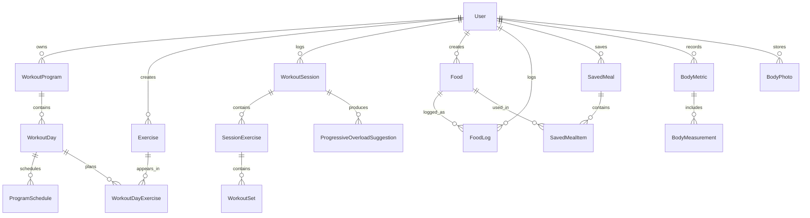

# Phase 1 Architecture

## Product Direction

Ascension is a mobile-first fitness app for strength training, calorie/macros tracking, progressive overload, AI meal suggestions, and body progress tracking. The product posture is premium, dark, fast, and low-friction during gym use.

Phase 1 creates the foundation only. Authentication implementation and product workflows begin in later phases.

## Architectural Decisions

1. **Next.js App Router with server-first rendering**
   Route segments are split by product area. Server components remain the default so data fetching stays close to pages and client bundles stay small.

2. **Feature-first domain boundaries**
   `src/features/*` owns domain logic, validations, server actions, and repository/service modules. `src/components/*` owns reusable presentation components grouped by domain.

3. **Prisma as the database contract**
   The schema is normalized around user ownership, immutable workout sessions, explicit session exercises, and ordered workout sets. Logged workout and nutrition rows snapshot user-visible history so later edits do not rewrite the past.

4. **Auth.js-compatible schema now, flows later**
   User, account, session, token, and authenticator tables are present so Phase 2 can add email/password plus Google auth without changing the core identity model.

5. **Computed analytics before stored analytics**
   Analytics should initially be derived from indexed workout, nutrition, and body tables. Dedicated summary tables can be added only when query volume proves they are needed.

6. **PWA from the start**
   The manifest and installability baseline are present now. Offline write queues and cache strategy will be completed after workout logging and nutrition flows exist.

7. **Explicit ownership guards**
   Public seed data and private user data can share tables only when all repository access goes through ownership guard helpers. See `docs/access-model.md`.

## Folder Structure

```text
src/
├── app/
│   ├── (auth)/
│   ├── dashboard/
│   ├── workouts/
│   ├── nutrition/
│   ├── body/
│   ├── analytics/
│   ├── settings/
│   └── api/
├── components/
│   ├── ui/
│   ├── shared/
│   ├── workouts/
│   ├── nutrition/
│   ├── body/
│   └── analytics/
├── features/
│   ├── auth/
│   ├── workouts/
│   ├── nutrition/
│   ├── body/
│   ├── analytics/
│   └── ai/
├── hooks/
├── lib/
│   ├── auth/
│   ├── constants/
│   ├── db/
│   ├── services/
│   ├── utils/
│   └── validations/
├── store/
├── styles/
└── types/
prisma/
└── schema.prisma
```

Prisma stays at repository root because the Prisma CLI expects that convention by default.

## Route Structure

| Route                          | Phase | Purpose                                  |
| ------------------------------ | ----- | ---------------------------------------- |
| `/`                            | 1     | Redirect/landing shell placeholder       |
| `/dashboard`                   | 1+    | Daily command center                     |
| `/workouts`                    | 3     | Programs, workout days, exercise library |
| `/workouts/log`                | 4     | Fast active workout logging              |
| `/nutrition`                   | 6     | Daily calories/macros and food logs      |
| `/nutrition/scan`              | 7     | Barcode scanner                          |
| `/nutrition/ai`                | 8     | AI meal suggestions                      |
| `/body`                        | 9     | Weight, measurements, photos             |
| `/analytics`                   | 10    | Workout, nutrition, and body trends      |
| `/settings`                    | 2+    | Account, units, goals, preferences       |
| `/api/health`                  | 1     | Deployment health check                  |
| `/api/foods/search`            | 6     | OpenFoodFacts search proxy               |
| `/api/foods/barcode/[barcode]` | 7     | Barcode lookup proxy                     |
| `/api/ai/meals`                | 8     | AI meal suggestion endpoint              |

## Database Diagram



## Prisma Schema Notes

- `WorkoutProgram`, `WorkoutDay`, and `WorkoutDayExercise` represent reusable planning.
- `WorkoutSession`, `SessionExercise`, and `WorkoutSet` represent actual logged training.
- `WorkoutSet` has nullable `weightKg`, `reps`, and `rir` so optimistic drafts can exist before completion.
- `SessionExercise` snapshots exercise name, muscle group, equipment, and category for immutable workout history.
- `supersetGroupId` is reserved on `SessionExercise` so supersets can be added without reworking logging.
- `Exercise.sourceKey` and `Food.sourceKey` provide stable idempotent import keys.
- `Food` supports seeded, OpenFoodFacts, and custom foods in one table with nullable `ownerId`.
- `FoodLog` snapshots food name, brand, per-100g nutrition values, and calculated logged macros.
- Macros use `Decimal` instead of floats to avoid nutrition math drift.
- `BodyPhoto.storageKey` is the durable reference. Signed URLs must be generated at runtime only.
- `BodyMeasurement.type` normalizes standard measurements. `labelKey` prevents duplicates, and `customLabel` is reserved for custom measurements.

## UI System

- Dark mode is the product default.
- Tailwind CSS variables follow shadcn/ui conventions.
- Cards use restrained radius and subtle borders.
- Mobile layouts are single-column first with thumb-friendly 44px minimum tap targets.
- Workout logging will use sticky exercise headers, inline set rows, optimistic updates, and large controls in Phase 4.
- Motion should be fast and functional: press feedback, sheet transitions, skeletons, and subtle progress highlights.

## Package Dependencies

Core:

- `next`, `react`, `react-dom`, `typescript`
- `tailwindcss`, `tailwindcss-animate`, `class-variance-authority`, `clsx`, `tailwind-merge`
- `@prisma/client`, `prisma`
- `next-auth`, `@auth/prisma-adapter`, `bcryptjs`
- `zod`, `react-hook-form`, `@hookform/resolvers`
- `lucide-react`, `recharts`, `zustand`
- `next-pwa`

Quality:

- `eslint`, `eslint-config-next`, `typescript-eslint`
- `prettier`, `prettier-plugin-tailwindcss`

## Environment Variables

Required locally:

- `DATABASE_URL`
- `DIRECT_URL`
- `NEXT_PUBLIC_APP_URL`
- `NEXT_PUBLIC_APP_NAME`

Required in Phase 2:

- `AUTH_SECRET`
- `AUTH_GOOGLE_ID`
- `AUTH_GOOGLE_SECRET`
- `AUTH_TRUST_HOST`

Required in later phases:

- `OPENAI_API_KEY`
- `OPENFOODFACTS_BASE_URL`
- `NEXT_PUBLIC_SUPABASE_URL`
- `NEXT_PUBLIC_SUPABASE_ANON_KEY`
- `SUPABASE_SERVICE_ROLE_KEY`

See also:

- `docs/access-model.md`
- `docs/offline-write-queue.md`
- `docs/phase-2-auth-decision.md`

## Docker Setup

Local Docker is intentionally small:

- `db`: PostgreSQL 16 with persistent volume and health check.
- `app`: production image target for parity testing.

Vercel remains the deployment target. Docker is for local database parity and optional production-style smoke tests.

## CI/CD Plan

GitHub Actions runs on pull requests and main:

1. Install dependencies with `npm ci`.
2. Generate Prisma client.
3. Run TypeScript checking.
4. Run ESLint.
5. Run Prettier check.
6. Build Next.js.

Later phases should add:

- Unit tests for domain logic.
- Integration tests for server actions and route handlers.
- Playwright mobile smoke tests for critical workout and nutrition flows.
- Prisma migration deploy check against staging.

## Phase Boundaries

Phase 1 stops at architecture, schema, and infrastructure. Phase 2 should implement Auth.js configuration, email/password credentials, Google provider, protected routes, and session-aware data access.
